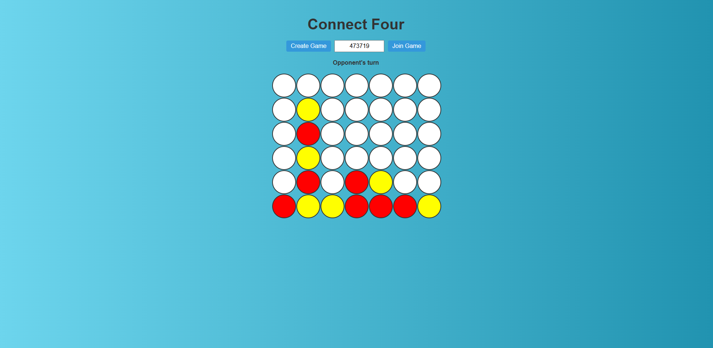

# Connect Four Multiplayer🎮 

A simple **multiplayer Connect Four game** built with **Node.js (backend)** and **vanilla HTML/CSS/JS (frontend)**.  
Two players can join the same game using a shared game code and play in real time.

👉 **[Play the live demo here!](https://connect-four-multiplayer.onrender.com/)**

**Note:** The Render deployment may **shut down after inactivity** (free plan).  
First load might take a few seconds to spin up the server.

---

## 🚀 Features
- Multiplayer support (Player 1 creates a game, Player 2 joins with a code).
- Turn-based gameplay with win/draw detection.
- Backend powered by Node.js (HTTP server + game logic).
- Frontend built with HTML, CSS, and JavaScript.
- Deployed on [Render](https://render.com) for public access.

---

## 🛠️ Tech Stack
- **Backend:** Node.js (http module, no frameworks)
- **Frontend:** HTML, CSS, Vanilla JS
- **Hosting:** Render
- **Version Control:** Git & GitHub
- **CI/CD:** GitHub Actions → automatic deploy to Render on push to `main`

---

## 📸 Screenshot


---

## 📦 Setup Locally
Clone the repo and install dependencies:

```bash
git clone https://github.com/TomerBitonn/Connect-Four-Multiplayer.git
cd Connect-Four-Multiplayer
node server/src/server.js
```

---

## 🔄 Deployment
### Every push to the main branch triggers a GitHub Actions workflow that:

- Checks out the code
- Calls the Render API
- Deploys the latest version automatically
